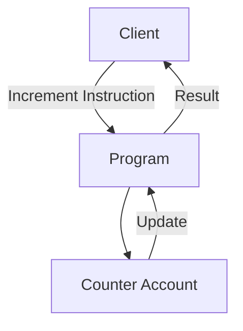

# Pinocchio Counter - Solana Program

A simple counter program demonstrating core Solana program concepts with minimal dependencies.

## Features

- Persistent on-chain counter state
- Single increment instruction
- Minimal program size (~50KB)
- Example CLI client included
- Integration test coverage

## Prerequisites

- Rust 1.65.0+
- Solana CLI 1.18.26+
- Local validator for testing

```bash
rustup component add rustfmt
cargo install solana-cli
```

## Building and Deploying

1. Build the program:
```bash
cargo build-bpf
```

2. Deploy to localnet:
```bash
solana program deploy target/deploy/pinocchio_counter.so
```

## Program Architecture



## Using the CLI Client

Run the example client:
```bash
cargo run --bin client
```

Expected output:
```
Payer balance: 0
Created counter account: 8bbPDP9RKSF3KWb6wwKgMAngYnGmhV39g8uBp4kuitmD
Incremented counter
Current counter value: 1
```

## Testing

Run integration tests:
```bash
cargo test --test integration-test
```

## Key Files

- `src/lib.rs`: Core program logic with entrypoint and instruction processing
- `client.rs`: Example CLI client demonstrating program interaction  
- `tests/integration-test.rs`: Program integration tests

## Performance Characteristics

- Transaction cost: ~500 CUs per increment
- Account size: 4 bytes (u32)
- Minimum rent exemption: 0.001 SOL

## Development

1. Start local validator:
```bash
solana-test-validator
```

2. Build and test changes:
```bash
cargo build-bpf && cargo test
```

## License

Apache 2.0
