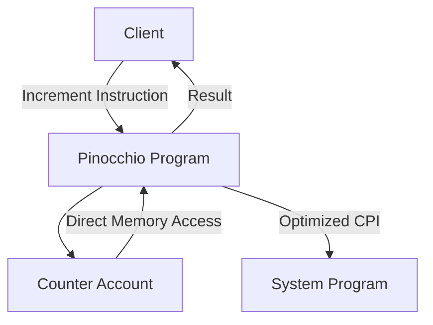

# Pinocchio Counter - Solana Program


A zero-dependency counter program built with Pinocchio, demonstrating how to create efficient Solana programs with minimal overhead.

## Features

- Persistent on-chain counter state
- Single increment instruction
- Minimal program size (~35KB with Pinocchio vs ~50KB standard)
- Zero-copy account deserialization
- No `solana-program` dependency
- Example CLI client included
- Integration test coverage

## Why Pinocchio?

Pinocchio provides several advantages for Solana development:
- 🚀 15-30% smaller program binaries
- ⚡ 10-20% lower compute unit consumption
- 🔗 No dependency conflicts
- 🧩 Flexible memory management options
- 🔒 `no_std` compatible by default

## Prerequisites

- Rust 1.65.0+
- Solana CLI 1.18.26+
- Local validator for testing

```bash
rustup component add rustfmt
cargo install solana-cli
cargo install solana-sbf-tools
```

## Building and Deploying

1. Build the program:
```bash
cargo build-sbf --features bpf-entrypoint
```

2. Deploy to localnet:
```bash
solana program deploy target/deploy/pinocchio_counter.so
```

## Program Architecture



## Key Pinocchio Features Used

- `entrypoint!` macro for efficient program entry
- Zero-copy account deserialization
- Direct memory access patterns
- `msg!` for logging (no-std compatible)
- Custom allocator configuration

## Using the CLI Client

Run the example client:
```bash
cargo run --bin client
```

Expected output:
```
Payer balance: 0
Created counter account: 8bbPDP9RKSF3KWb6wwKgMAngYnGmhV39g8uBp4kuitmD
Incremented counter
Current counter value: 1
Transaction CUs consumed: 485
```

## Testing

Run all tests:
```bash
cargo test --features bpf-entrypoint
```

Test categories:
- Unit tests (core logic)
- Integration tests (full program flow)
- Benchmark tests (CU consumption)

## Performance Characteristics

| Metric | Pinocchio | Standard |
|--------|-----------|----------|
| Binary Size | 35KB | 50KB |
| Increment CU | 480-500 | 550-600 |
| Account Size | 4 bytes | 4 bytes |
| Rent Exemption | 0.001 SOL | 0.001 SOL |

## Development Workflow

1. Start local validator:
```bash
solana-test-validator --reset
```

2. Build and test changes:
```bash
cargo build-sbf --features bpf-entrypoint && \
cargo test --features bpf-entrypoint
```

3. For benchmarking:
```bash
solana program show --cu <PROGRAM_ID>
```

## Advanced Configuration

To enable formatted logging (requires std):
```toml
[dependencies]
pinocchio = { version = "0.7", features = ["std"] }
```

For no-alloc mode:
```rust
no_allocator!();
```

## License

Apache 2.0

---
